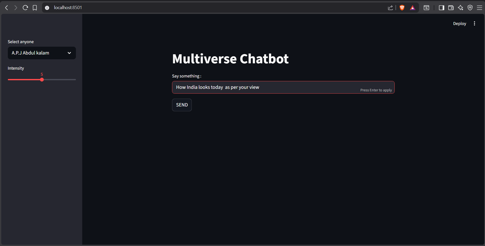

# Multiverse Chatbot

## Features

- Multiple AI personalities
- Roleplay-based responses
- Adjustable response intensity using a slider
- Clean Streamlit interface with sidebar controls
- Powered by Google Gemini 2.5 Flash
- Secure API key management using `.env`

## Application Preview

## Pre-Submission Checklist
- [✅] Have you saved your app.py file before testing the server?
- [✅] Does your terminal successfully display a "Local URL" (e.g., http://localhost:8501) without tracebacks?
- [✅] Have you tested the edge cases (e.g., clicking the button with only the name provided, but no message)?